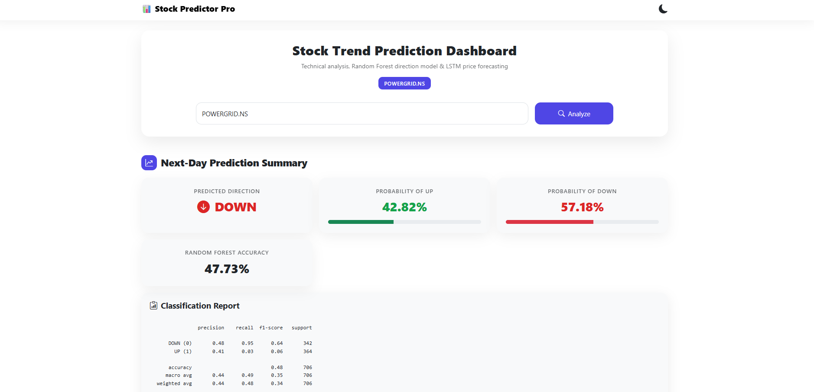

# 📊 Stock Trend Prediction Dashboard

A full-stack machine learning web application that combines **LSTM deep learning** and **Random Forest classification** to analyze stock market trends and predict next-day price direction — built with Flask and deployed as an interactive dashboard.

---

## 🔗 Live Demo & Repository

- 🌐 **App:** *(Deploy link)*  
- 💻 **GitHub:** [UHDNMJayalath/Stock-Trend-Prediction-Project](https://github.com/UHDNMJayalath/Stock-Trend-Prediction-Project)

---

## 🖼️ Preview

| Dashboard | EDA Overview |
|-----------|-------------|
|  |  |

| LSTM Prediction | Feature Importance |
|-----------------|-------------------|
|  |  |

---

## ✨ Features

| Feature | Description |
|---------|-------------|
| 📈 **EMA Charts** | 20, 50, 100 & 200 day Exponential Moving Averages |
| 🔴 **RSI Indicator** | Overbought / Oversold signals with visual zones |
| 🧠 **LSTM Forecast** | Deep learning price prediction vs actual trend |
| 🌲 **Random Forest** | Next-day UP/DOWN direction classification |
| 🔥 **Feature Importance** | Top 18 technical indicators ranked by importance |
| 📉 **Confusion Matrix** | Model performance visualization |
| 📊 **EDA Dashboard** | Moving averages, return distribution, correlation heatmap |
| ⬇️ **CSV Export** | Download full historical dataset |
| 🌙 **Dark Mode** | Toggle between light and dark themes |

---

## 🛠️ Tech Stack

```
Backend          Flask (Python)
ML Models        LSTM (Keras/TensorFlow) + Random Forest (scikit-learn)
Data Source      Yahoo Finance (yfinance)
Visualization    Matplotlib + Seaborn
Frontend         HTML5 + Bootstrap 5 + Bootstrap Icons
Deployment       Gunicorn
```

---

## 📐 Architecture

```
User Input (Stock Symbol)
        │
        ▼
  Yahoo Finance API
        │
        ▼
  Feature Engineering ──────────────────────────────┐
  (RSI, MACD, EMA, Bollinger Bands, Volatility...)  │
        │                                            │
        ▼                                            ▼
  LSTM Model                              Random Forest Classifier
  (Price Forecasting)                     (UP / DOWN Prediction)
        │                                            │
        ▼                                            ▼
  Prediction vs Actual Chart          Next-Day Direction + Probability
        │                                            │
        └──────────────┬─────────────────────────────┘
                       ▼
              Flask Web Dashboard
```

---

## 📦 Installation

```bash
# 1. Clone the repository
git clone https://github.com/UHDNMJayalath/Stock-Trend-Prediction-Project.git
cd Stock-Trend-Prediction-Project/model

# 2. Create virtual environment
python -m venv env
source env/bin/activate        # Linux/Mac
env\Scripts\activate           # Windows

# 3. Install dependencies
pip install -r requirements.txt

# 4. Run the app
python app.py
```

Open `http://127.0.0.1:5000` in your browser.

---

## 📋 Requirements

```
flask
numpy
pandas
scikit-learn
matplotlib
yfinance
seaborn
tensorflow==2.15.1
keras==2.15.1
h5py
gunicorn
```

---

## 🧠 Models

### LSTM (Long Short-Term Memory)
- 4-layer LSTM network trained on historical closing prices
- Uses last 100 days as input window
- Trained on 70% of historical data, tested on 30%
- Outputs: Predicted vs Actual price trend chart

### Random Forest Classifier
- 200 decision trees, max depth 10
- 18 input features including RSI, MACD, Bollinger Bands, volatility
- Outputs: UP/DOWN prediction with probability scores
- Trained on 80% of feature-engineered data

---

## 📊 Technical Indicators Used

| Category | Indicators |
|----------|-----------|
| **Trend** | SMA 10/20, EMA 10/20/50/100/200 |
| **Momentum** | RSI (14), MACD, MACD Signal |
| **Volatility** | Bollinger Bands (High/Low), Volatility 5-day |
| **Price Action** | Daily Return, Price Change, High-Low Spread |
| **Volume** | Volume, Volume Change |

---

## 💡 How to Use

1. Enter a stock symbol in the search bar
   - Indian stocks: `POWERGRID.NS`, `TCS.NS`, `RELIANCE.NS`
   - US stocks: `AAPL`, `GOOG`, `MSFT`, `TSLA`
2. Click **Analyze**
3. View EMA trends, RSI, EDA overview
4. Check LSTM prediction vs actual price
5. See next-day UP/DOWN prediction with probability
6. Download the full dataset as CSV

---

## 📁 Project Structure

```
Stock-Trend-Prediction-Project/
│
├── model/
│   ├── app.py                    # Flask application
│   ├── stock_dl_model.h5         # Pre-trained LSTM model
│   ├── requirements.txt          # Python dependencies
│   ├── runtime.txt               # Python version
│   ├── Stock Trend Prediction.ipynb  # Research notebook
│   │
│   ├── templates/
│   │   └── index.html            # Frontend dashboard
│   │
│   └── static/                   # Generated chart images
│
└── README.md
```

---

## 📈 Sample Results (POWERGRID.NS)

- ✅ Random Forest Accuracy: ~55–60%
- 📉 LSTM captures long-term trend patterns effectively
- 🔑 Top features: Daily Return, RSI, Volatility, Price Change

---

## ⚠️ Disclaimer

> This project is for **educational and portfolio purposes only**.  
> Stock market predictions are inherently uncertain.  
> **Do not use this as financial advice.**

---

## 👩‍💻 Author

**Nishaka Mahesh Jayalath**  
Data Science Portfolio Project — 2026  

[](https://linkedin.com/in/nishaka-jayalath)
[](https://github.com/UHDNMJayalath)

---

## ⭐ If you found this useful, please give it a star!
